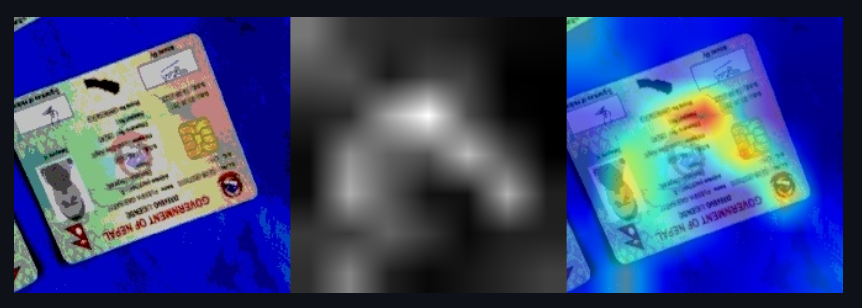
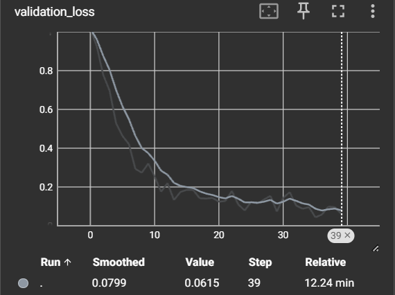
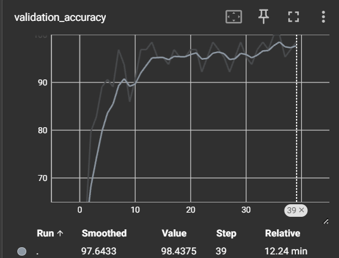
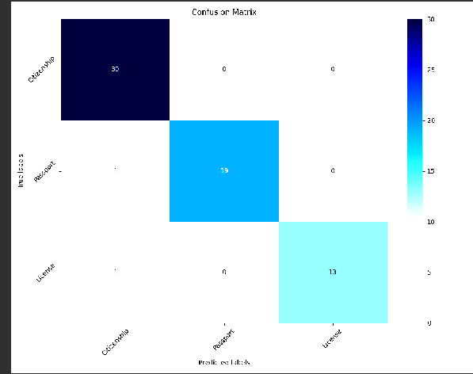
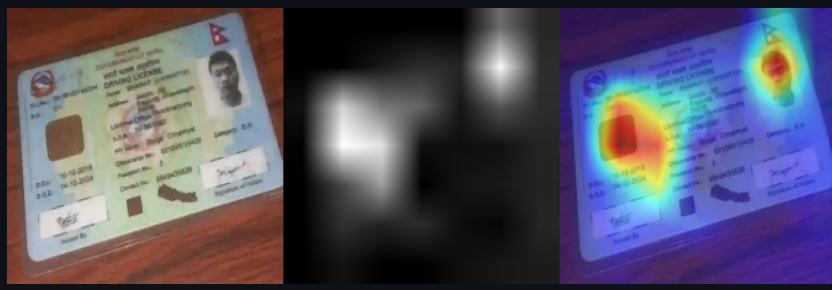

## Notes on image extension
[Image Extension](/Notes_image_extension.md)    

## Current class structure 
    Citizenship=0 🌐
    Passport=1 🛂
    License=2 🚗

## Data Pipeline 🛠️
[Data-pipeline](/Pipeline.md)

## Model Training 🚀
- ### First iteration
    - [Data-pipeline](/assets/Datasetspecification_v1.md)
    - #### Model Hyperparameters
        - **Batch Size:** 8
        - **Optimizer:** SGD
        - **Loss Function:** Cross Entropy 
        - **Iterations:** 40

    - ##### Model Evaluation
        - **Validation Accuracy:** 95%
        - **Validation Training Curve:** 
        - **Validation Accuracy Curve:** 
        - **Confusion Matrix:**  
    ## Analysis:
      While the validation accuracy appears satisfactory, it was influenced by aggressive augmentation techniques, such as significantly increasing brightness, resulting in some images becoming entirely black or white. This had a detrimental effect on the model's accuracy. Analyzing Grad-CAM demonstrated that the model was indeed focusing on the correct areas for classification.
    
      This Grad-CAM demonstration showcases the model's ability to handle augmentation, directing its attention primarily towards relevant documents while largely disregarding the background.
- ### Second iteration
    - [Data-pipeline](/assets/Datasetspecification_v1.md)
    - #### Model Hyperparameters
        - **Batch Size:** 16
        - **Optimizer:** SGD
        - **Loss Function:** Cross Entropy 
        - **Iterations:** 40

    - ##### Model Evaluation
        - **Validation Accuracy:** 98%
        - **Validation Training Curve:** 
        - **Validation Accuracy Curve:** 
        - **Confusion Matrix:**  
    ## Analysis:
      Fixing augmentaion pipeline the model was able to gain additional accuracy points.
    
      In document inference, the model accurately identifies driver's licenses by prioritizing the magnetic portion, absent in passports and citizenship documents. 