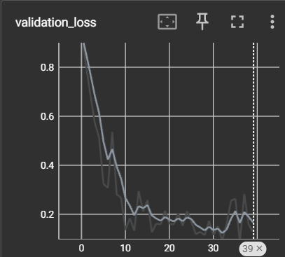
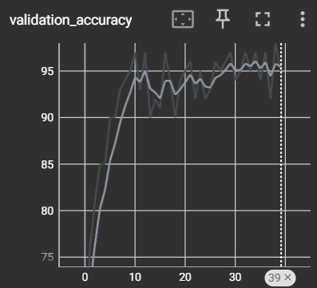

## Notes on image extension
[Image Extension](/Notes_image_extension.md)    

## Current class structure 
    Citizenship=0 🌐
    Passport=1 🛂
    License=2 🚗

## Data Pipeline 🛠️
[Data-pipeline](/Pipeline.md)

## Model Training 🚀
- ### First iteration
    - [Data-pipeline](/assets/Datasetspecification_v1.md)
    - #### Model Hyperparameters
        - **Batch Size:** 8
        - **Optimizer:** SGD
        - **Loss Function:** Cross Entropy 
        - **Iterations:** 40

    - ##### Model Evaluation
        - **Validation Accuracy:** 95%
        - **Validation Training Curve:** 
        - **Validation Accuracy Curve:** 
        - **Confusion Matrix:** !
        [Confusion Matrix](assets/Images/May-08_14-52-58/Screenshot%202024-05-09%20091641.png)