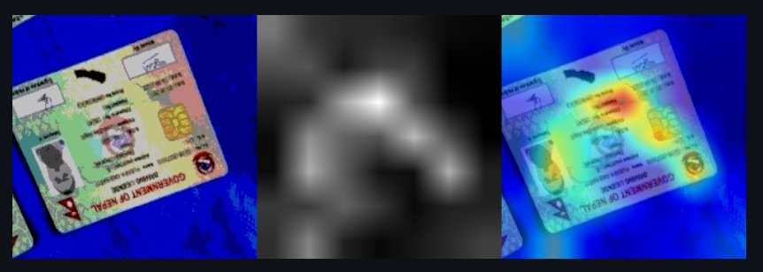
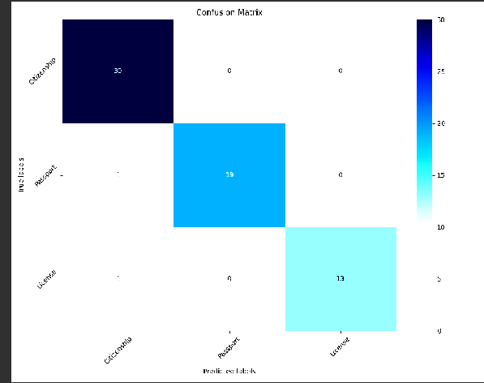
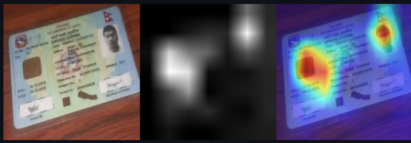

## Notes on image extension
[Image Extension](/Notes_image_extension.md)    

## Current class structure 
    Citizenship=0 🌐
    Passport=1 🛂
    License=2 🚗

## Data Pipeline 🛠️
[Data-pipeline](/Pipeline.md)

## Model Training 🚀
## ResNet50
- ### First iteration
    - [Data-pipeline](/assets/Datasetspecification_v1.md)
    - #### Model Hyperparameters
        - **Batch Size:** 8
        - **Optimizer:** SGD
        - **Loss Function:** Cross Entropy 
        - **Iterations:** 40

    - ##### Model Evaluation
        - **Validation Accuracy:** 95%
        - **Validation Training Curve:** 
        - **Validation Accuracy Curve:** 
        - **Confusion Matrix:**  
    ## Analysis:
    While the validation accuracy appears satisfactory, it was influenced by aggressive augmentation techniques, such as significantly increasing brightness, resulting in some images becoming entirely black or white. This had a detrimental effect on the model's accuracy. Analyzing Grad-CAM demonstrated that the model was indeed focusing on the correct areas for classification.
     
    This Grad-CAM demonstration showcases the model's ability to handle augmentation, directing its attention primarily towards relevant documents while largely disregarding the background.
- ### Second iteration
    - [Data-pipeline](/assets/Datasetspecification_v1.md)
    - #### Model Hyperparameters
        - **Batch Size:** 16
        - **Optimizer:** SGD
        - **Loss Function:** Cross Entropy 
        - **Iterations:** 40

    - ##### Model Evaluation
        - **Validation Accuracy:** 98%
        - **Validation Training Curve:** 
        - **Validation Accuracy Curve:** 
        - **Confusion Matrix:**  
    ## Analysis:
    Fixing augmentaion pipeline the model was able to gain additional accuracy points.
     
    In document inference, the model accurately identifies driver's licenses by prioritizing the magnetic portion, absent in passports and citizenship documents. 
## Current class structure 
    Citizenship=0 🌐
    Passport=1 🛂
    License=2 🚗
    Other=3

- ### Third iteration
    - [Data-pipeline](/assets/Datasetspecification_v1.md)
    - #### Model Hyperparameters
        - **Batch Size:** 8
        - **Optimizer:** SGD
        - **Loss Function:** Cross Entropy 
        - **Iterations:** 40

    - ##### Model Evaluation
        - **Validation Accuracy:** 86.25%
        - **Validation Training Curve:** 
        - **Validation Accuracy Curve:** 
        - **Confusion Matrix:**  
    ## Analysis:
        The low attribute of this model is due to the amount of data in in the other categories initial only 16 images were added without augmentation which has skewed the model predection and inference this problem is solved in later itteration by adding more data.
     
- ### Fourth itteration
    - [Data-pipeline](/assets/Datasetspecification_v1.md)
    - #### Model Hyperparameters
        - **Batch Size:** 8
        - **Optimizer:** SGD
        - **Loss Function:** Cross Entropy 
        - **Iterations:** 40

    - ##### Model Evaluation
        - **Validation Accuracy:** 86.25%
        - **Validation Training Curve:** 
        - **Validation Accuracy Curve:** 
        - **Confusion Matrix:**  
    ## Analysis:
        The low performance of this model is due to the limited amount of data in other categories. Initially, only 16 images were added without augmentation, which skewed the model's predictions and inferences. This problem is addressed in later iterations by adding more data.
- ### Fith itteration
    - [Data-pipeline](/assets/Datasetspecification_v1.md)
    - #### Model Hyperparameters
        - **Batch Size:** 8
        - **Optimizer:** SGD
        - **Loss Function:** Cross Entropy 
        - **Iterations:** 40

    - ##### Model Evaluation
        - **Validation Accuracy:** 93.75%
        - **Validation Training Curve:** 
        - **Validation Accuracy Curve:** 
        - **Confusion Matrix:**  
    ## Analysis:
        This itteration tackles the problem of the previous itteration and increase the validation accuracy
# DoCx Classsifier
[Paper link](https://www.techrxiv.org/doi/full/10.36227/techrxiv.19310489.v1) 

- ### Model evaluation
    - #### Model Hyperparameters
        - **Batch Size:** 8
        - **Optimizer:** SGD
        - **Loss Function:** Cross Entropy 
        - **Iterations:** 40
    - ##### Model Evaluation
        - **Validation Training Curve:**   
        - **Validation Accuracy Curve:**   
   The model's poor performance is likely due to limited training data and an excessive number of parameters, causing it to overfit. Overfitting happens when the model learns the training data too well, capturing noise rather than general patterns, leading to poor generalization on new data. To improve, one could increase the training data or reduce the model's complexity through parameter reduction or regularization techniques. Balancing model complexity with adequate data is essential for better performance.